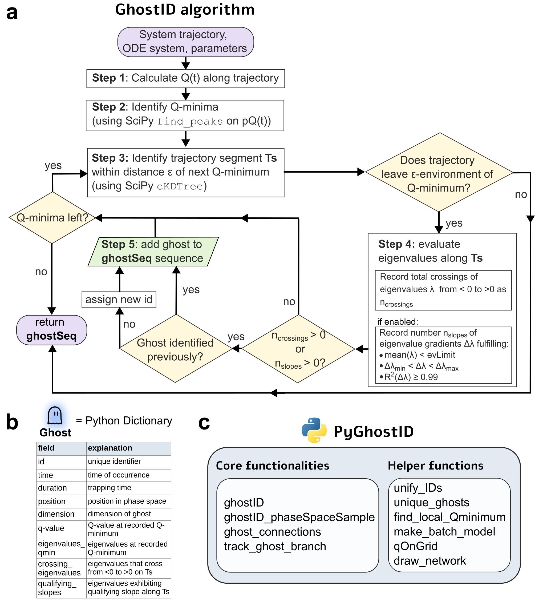

# Overview

## Background
PyGhostID is a Python package for identifying generalized saddle-node ghosts in the vicinity of saddle-node bifurcations and their composite ghost structures such as ghost channels and ghost cycles in dynamical systems. PyGhostID's main function is the implementation of GhostID, a trajectory-based algorithm to identify saddle-node ghosts in dynamical systems. Besides the main algorithm, additional functions allow users to identify composite structures of ghosts (ghost cycles, channels and networks) and track ghosts versus changing parameters.


**Figure 1**: (a) flow-diagram of ghostID, (b) data associated with ghost states, (c) functionalities of the PyGhostID package.

## Installation

Install the latest version of PyGhostID via pip:

```bash
pip install PyGhostID
```
## Contact

For questions or additional information, please contact [Daniel Koch](mailto:daniel.koch@umanitoba.ca).

## Citation

If you use PyGhostID or its repository in your research, please cite our paper:
[Daniel Koch, Akhilesh Nandan (2026). Generalized saddle-node ghosts and their composite structures in dynamical systems. arxiv: 2604.05194.](http://arxiv.org/abs/2604.05194)

