# Tutorials

The following tutorials explain in detail how to use the core functionalities of PyGhostID.

The code for all tutorials can be found on [github](https://github.com/KochLabCode/PyGhostID/tree/main/tutorials).

## Tutorial 1 - ghostID parameter optimization and trouble-shooting

While using `ghostID` is simple, successfull identification of ghosts can be tricky depending on the system and the type of ghost. `ghostID` has a number of hyperparameters you can tune and features that can help you finding the correct parameter values for your case. This tutorial shows you how to do that.

### Using ghostID's control outputs

GhostID utilizes maxima of the function $pQ(t) = -\textnormal{log}(\frac{||f(x,\rho)||^2}{2})$ to identify slow points along a trajectory as candidates for ghosts and checks if one or more eigenvalues along the trajectory changes sign from negative to positive within a small neighborhood of the slow points. As central quantities of evaluation, `ghostID` provides control plots that allow visual inspection of $pQ$ values and eigenvalues and provide important clues which help to optimize parameters and figure out potential issues related to the identification of ghosts in a system of interest. Let's use the normal form example from the basic usage tutorial to look at these control plots. To do that, we have to set the following kwargs when calling ghostID: `ctrlOutputs={"ctrl_qplot":True,"ctrl_evplot":True}`

```python
# imports
import numpy as np
import jax.numpy as jnp
from scipy.integrate import solve_ivp
import PyGhostID as gid

# define model
def normalform_SN_bifurcation(t,z,para):

    mu=para[0]
    dx = mu + z[0]**2
    dy= -z[1]
         
    return jnp.stack([dx, dy])

# set model parameters
mu = 0.01

# set time parameters
dt = 0.05
t_end = 30
timesteps = np.linspace(0,t_end,int(t_end/dt))

# initial conditions
x0 = -1
y0 = 0.5

# run simulation
sol = solve_ivp(normalform_SN_bifurcation, (0, t_end), [x0,y0], t_eval=timesteps, args=([mu],),method='RK45')

# extract trajectory
trajectory=sol.y.T

# run ghostID
ghostSeq = gid.ghostID(normalform_SN_bifurcation,[mu],dt,trajectory, ctrlOutputs={"ctrl_qplot":True,"qplot_xscale":"linear","ctrl_evplot":True})
```

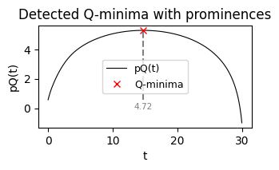
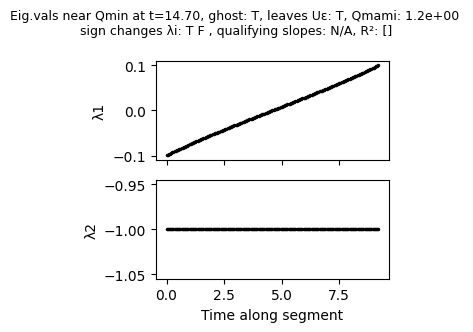

The first plot shows the $pQ(t)$ profile along with identified maxima/peaks (in this case only one) and their prominence, i.e. height over the local baseline. The second plot shows the eigenvalues along the trajectory within the neighborhood of the identified slow points. It shows that the first eigenvalue $\lambda_1$ increases almost linearly from $-0.1$ to $0.1$, thus confirming that we have found a ghost. The second eigenvalue does not change and stays negative within the neighborhood considered. The title of the second plot also features some additional information:
- the time at which the Q-minimum (=pQ-maximum), i.e., the slowest point along this trajectory segment, is found
- whether the algorithm considers the slow point to be a ghost
- whether the trajectory leaves the neighborhood of the slow point eventually
- Qmami: ratio of the maximum and the minimum eigenvalue along the trajectory segment
- whether any of the eigenvalues change sign
- if the indirect eigenvalue criterion is enabled: whether eigenvalue slopes are considered within range and what the R² value of the linear fit is

By default, ghostID shows the control plots on its own. If you want to modify these plots or only look at selected control plots from multiple ghosts, you can set `ctrlOutputs={"ctrl_qplot":True,"ctrl_evplot":True,"return_ctrl_figs":True}` in which case ghostID will simply return the selected types of control plots without showing them.

### Optimizing parameters for identification of slow points

Identification of slow points from the $pQ(t)$ profile of a trajectory can fail due to various reasons such spurious peaks or too many peaks due to numerical settings. Often, these can be resolved by lowering the numerical tolerances of the simulation - at the expense of longer runtimes. If that is not feasible, ghostID offers a number of ways of optimizing identification of slow points. Let us consider a two-dimensional model from [Bieg et al.](https://link.springer.com/article/10.1007/s10021-023-00892-8) shown to have a ghost. For illustrative purposes, we'll use poor numerical tolerances to run the simulation and then apply ghostID to the resulting trajectory:

```python
def bieg_etal(t,z,para):

    a,Nt,N0,g,y,r,c,m = para
    B = 1-z[0]-z[1]
    dC = z[0]*(r*(1-c*Nt)*B-m-a*z[1]*(Nt/(N0+Nt)))
    dM = z[1]*(a*z[0]*(Nt/(N0+Nt))-g/(z[1]+B)+y*B)

    return jnp.array([dC, dM])

# set parameters
a = 2.0; y = 0.7; m = 0.15; g = 0.4; Nt = 0.53; N0 = 0.5; r = 1.8; c = 0.25
parameters_bieg =  [a,Nt,N0,g,y,r,c,m]

# set time parameters
dt = 0.05
t_end = 80
timesteps = np.linspace(0,t_end,int(t_end/dt))

# simulate trajectory 
sol = solve_ivp(bieg_etal, (0, t_end), [0.07,0.6], t_eval=timesteps, args=(parameters_bieg,),method='RK45',rtol=1e-3,atol=5e-4)

# run ghostID
Trj_bieg=sol.y.T
ghostSeq = gid.ghostID(bieg_etal,parameters_bieg,dt,Trj_bieg,ctrlOutputs={"ctrl_qplot":True},display_warnings=False)
```

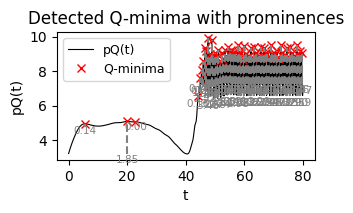

As you can see, the $pQ(t)$ profile features a single clear peak between t=5 and t=10, followed by another broader peak at about t=20. However, ghostID erroneously  found 2 peaks here. After t=45 or so, we can see a plethora of additional peaks due to numerical noise once the trajectory has reached a fixed point. Luckily these don't slow down ghostID as the algorithm automatically detects that the trajectory does not leave the neighborhood of the fixed point / equilibrium, hence it cannot be a ghost which is a transient state. However, spurious peaks can lead to identification of multiple ghosts where there is only one ghosts. GhostID has several ways to prevent this but starting with detecting only "real" peaks in the $pQ(t)$ profile is always a good idea. Since ghostID relies on SciPy's `find_peaks` function, we can use any of its [kwargs](https://docs.scipy.org/doc/scipy/reference/generated/scipy.signal.find_peaks.html) to alter peak identification behavior. To do so, we can use ghostID's kwarg `peak_kwargs`, which in turns can contain all kwargs accepted by `find_peaks`.

Let us start with filtering peaks by prominence and consider only peaks with a prominence of at 0.1 above the local baseline:

```python
ghostSeq = gid.ghostID(bieg_etal,parameters_bieg,dt,Trj_bieg,peak_kwargs={"prominence":0.1},ctrlOutputs={"ctrl_qplot":True},display_warnings=False)
```

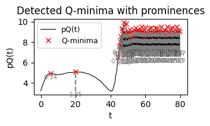

This removed the spurious peaks at around t=20 which now appears only as a single peak. However, the peaks after t>45 still persists.
While not necessary in this case, we can further clean up our $pQ(t)$ profile by using the `width`  parameter. Requiring all peaks to have a minium width of at least 10 leaves us with only the two slow points that we'd expect from checking the profile by eye:

```python
ghostSeq = gid.ghostID(bieg_etal,parameters_bieg,dt,Trj_bieg,peak_kwargs={"prominence":0.1, "width":10},ctrlOutputs={"ctrl_qplot":True},display_warnings=False)
```

### Issues with eigenvalue profiles

Even if pQ(t) profiles are flawless, identification of ghosts can fail due issues with the eigenvalue profiles of a trajectory segment in the neighborhood of a slow point. Sometimes, eigenvalue profiles are discontinuous or scattered, violating the required monotic crossing from negative to positive eigenvalues. This can happen because eigenvalue indexing along a trajectory segment is not guaranteed to be consistent across consecutive time steps due to numerical reasons (i.e. $\lambda_1$ at time $t$ may be labeled $\lambda_2$ at time $t+1$). As an example we consider a simple GRN model from [Farjami et al.](https://doi.org/10.1098/rsif.2021.0442) which is organized close to three co-occuring SNIC bifurcations so that the trajectory on the limit cycle has to pass through three different ghosts:

```python
def farjami_etal(t,x,p):
  
    g = p
    
    g1 = g; g2 = g; g3 = g
    
    b1 = 1e-5; b2 = 1e-5; b3 = 1e-5
    alpha1 = 9; alpha2 = 9; alpha3 = 9
    beta1 = 0.1; beta2 = 0.1; beta3 = 0.1
    h = 3
    d1 = 0.2; d2 = 0.2; d3 = 0.2
    
    dx1 = b1 + g1 / ((1+alpha1*(x[1]**h))*(1+beta1*(x[2]**h))) - d1*x[0]
    dx2 = b2 + g2 / ((1+alpha2*(x[2]**h))*(1+beta2*(x[0]**h))) - d2*x[1]
    dx3 = b3 + g3 / ((1+alpha3*(x[0]**h))*(1+beta3*(x[1]**h))) - d3*x[2]
    
    return jnp.array([dx1, dx2, dx3])


# set parameters
g_Farjami=1.5

# set time parameters
t_end = 550
dt = 0.1
timesteps = np.linspace(0,t_end,int(t_end/dt))

# simulate trajectory 
ICs = [0.6,0.8,0.8]
sol = solve_ivp(farjami_etal, (0, t_end), ICs,
                    t_eval=timesteps, args=(g_Farjami,),method='RK45',rtol=1e-6,atol=1e-6)

# run ghostID
Trj_farjami=sol.y.T
ghostSeq = gid.ghostID(farjami_etal,g_Farjami,dt,Trj_farjami,peak_kwargs={"prominence":5,"width":200,"distance":20},
                                                     ctrlOutputs={"ctrl_qplot":True,"ctrl_evplot":True})


# plot identified ghosts in 3D
import matplotlib.pyplot as plt
fig = plt.figure(figsize=(4,4))
ax = fig.add_subplot(projection='3d')
ax.plot(Trj_farjami[:,0],Trj_farjami[:,1],Trj_farjami[:,2],color='k',alpha=0.75)
for g in ghostSeq:
    ax.scatter(g["position"][0],g["position"][1],g["position"][2],s=100,marker="o",label=g["id"])
ax.set_xlabel("x1")
ax.set_ylabel("x2")
ax.set_zlabel("x3")
ax.set_box_aspect(None, zoom=0.65)
ax.view_init(elev=30, azim=45)
plt.legend()
```

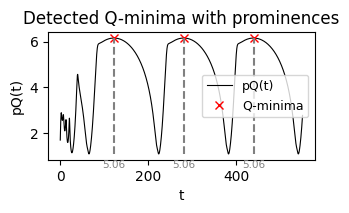
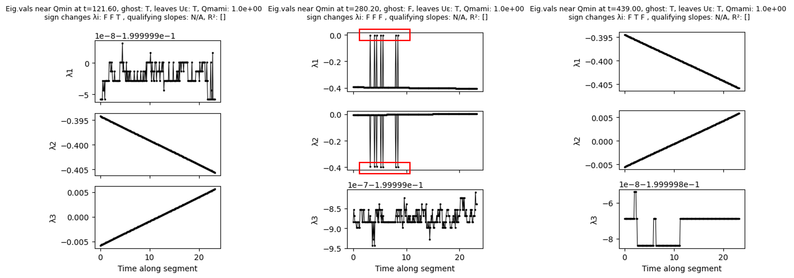
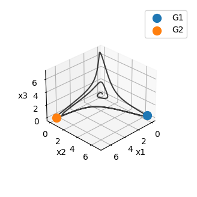

The $pQ(t)$ profile look fine and as you can see, ghostID correctly identified two of the three ghosts, but missed the third one.

Looking at the eigenvalue control plots we can see that eigenvalue profiles often look scattered or discontinuous. More often than not the scattering happens on a very small scale (look at the scaling of the y-axis!) and so can be disregarded as numerical noise. However, looking at $\lambda_1$ and $\lambda_2$ of the slow point at t=280.2, we can see that we have large scale discontinuities that are unlikely due to numerical noise. Looking further at the absolute values of both eigenvalue profiles, it looks like the values of $\lambda_1$ and $\lambda_2$ have been occasionally swapped - likely due to a change of indices by the numerical procedure to estimate eigenvalues. Such discontinuities also cause ghostID to throw the error message:

```plaintext
Error in evaluating sign change of eigenvalues: monotonicity violated.
```

However, this error is not specific for the issue and, as we will see below, can also occur in other contexts. GhostID has two ways of dealing with this issue: outlier removal and eigenvalue sorting. For outlier removal, we simple use the kwarg `ev_outlier_removal=True`:

```python
ghostSeq = gid.ghostID(farjami_etal,g_Farjami,dt,Trj_farjami,peak_kwargs={"prominence":5,"width":200,"distance":20},
                                                     ev_outlier_removal=True,
                                                     ctrlOutputs={"ctrl_qplot":False,"ctrl_evplot":True})
```

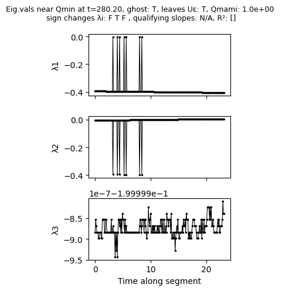

While the eigenvalue profile has not changed, the outlier removal leads ghostID to ignore the outlier for evaluating the eigenvalue criterion, leading to successful identification of the third ghost in the system. This is also reflected by the message 
```plaintext
Error in evaluating sign change of eigenvalues: monotonicity violated. Trying outlier removal... 
... success.
``` 
which ghostID returns.

Outlier removal is based on a deviation cutoff within a moving window along the eigenvalue profile. If necessary, cutoff and size of the moving window can be further fine-tuned - see API reference for details.

While outlier removal works well for limited local discontinuities in the eigenvalue profiles, it will fail for more complex scattering of eigenvalue profiles. In such cases, we can resort to sorting eigenvalues from scratch using a nearest-neighbour prediction via the kwarg `eigval_NN_sorting=True`:

```python
ghostSeq = gid.ghostID(farjami_etal,g_Farjami,dt,Trj_farjami,peak_kwargs={"prominence":5,"width":200,"distance":20},
                                                     eigval_NN_sorting=True,
                                                     ctrlOutputs={"ctrl_qplot":False,"ctrl_evplot":True})
```
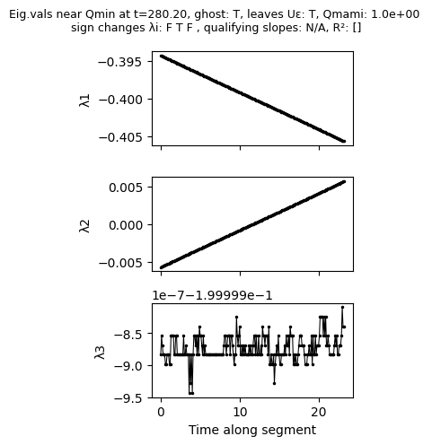

As we can see, the eigenvalue sorting removed the scattering of $\lambda_1$ and $\lambda_2$ by correctly re-assigning the scattered values to the right eigenvalue labels, thereby enabling correct ghost identification.

### Choosing the size of the neighborhood around identified slow points

The parameter `epsilon_gid` controls the size of the neighborhood around a slow point and thus the size of the trajectory segment along which to assess eigenvalues. The default value is `epsilon_gid = 0.05` which we found to work fine in many systems that we have considered but the appropriate value very much depends on the spatial and time scales of the system of interest. Looking at the eigenvalue profiles helps to find an appropriate value. To illustrate this, we return to the simple ecological model introduced above. Starting with `epsilon_gid = 0.01`, we can see that although the eigenvalues at the beginning of the trajectory segment at about $t=40$ are very close to zero, the trajectory segment is too short to capture the crossing of eigenvalues from negative to positive:

```python
ghostSeq = gid.ghostID(bieg_etal,parameters_bieg,dt,Trj_bieg,epsilon_gid = 0.01,peak_kwargs={"prominence":0.1, "width":10},ctrlOutputs={"ctrl_qplot":False,"ctrl_evplot":True})
```

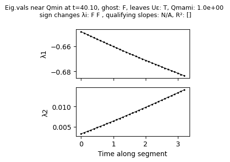

As before, using the default value `epsilon_gid = 0.05` is sufficient to capture the crossing of eigenvalue $\lambda_2$ from negative to positive:

```python
ghostSeq = gid.ghostID(bieg_etal,parameters_bieg,dt,Trj_bieg,epsilon_gid = 0.05,peak_kwargs={"prominence":0.1, "width":10},ctrlOutputs={"ctrl_qplot":False,"ctrl_evplot":True})
```

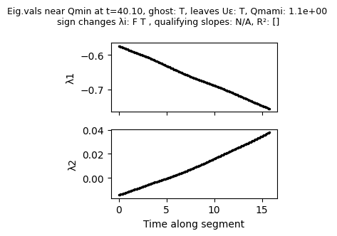

However, increasing further, e.g., to `epsilon_gid = 0.15`, leads to a violation of the monotonicity condition required by algorithm: $\lambda_1$ declines for a while before increasing again and crossing from negative to positive values.

```python
ghostSeq = gid.ghostID(bieg_etal,parameters_bieg,dt,Trj_bieg,epsilon_gid = 0.15,peak_kwargs={"prominence":0.1, "width":10},eigval_NN_sorting=True,ctrlOutputs={"ctrl_qplot":False,"ctrl_evplot":True})
```
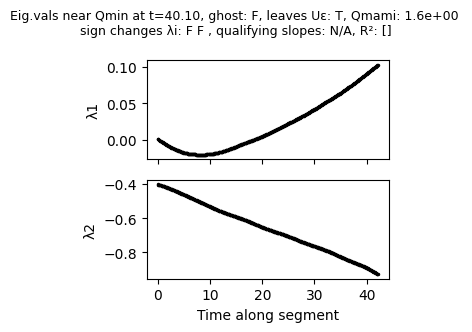

As a general rule, ghost identification works best if the size of the segment is chosen large enough such that eigenvalues cross from negative to positive roughly at the center of eigenvalue control plots and small enough to avoid non-monotic eigenvalue profiles resulting from visiting other areas of the phase space.

### Identifying too many or too few ghosts

Depending on the system, the numerical approach and the initial conditions, it can happen that ghostID identifies multiple ghosts where there is only a single ghost present. This may occur, for example, in a ghost cycle where, depending on the initial conditions, a trajectory visits a ghost multiple times but the first time the trajectory did not pass through the center of the ghost and just about captured the eigenvalue crossing, whereas in subsequent visits it passes through the center of the ghost. Another frequent situation is the use of multiple trajectories to identify as many ghosts as possible in a phase space area of interest.

For the first case, we consider again the GRN leading to a ghost cycle that we used above to illustrate issues that can occur with the eigenvalue profiles. This time, we use slightly different parameters (g = 1.49 instead of g = 1.5) and different initial conditions. If a trajectory visits a ghost twice, ghostID automatically checks if it has already identified this ghost previously using a distant threshold (`delta_gid`) before assigning an identitifier to a ghost. Since the default value `delta_gid = 0.1` is sufficient to prevent the issue, we have to lower it to `delta_gid=0.01`:

```python
# set parameters
g_Farjami=1.49

# set time parameters
t_end = 550
dt = 0.1
timesteps = np.linspace(0,t_end,int(t_end/dt))

# simulate trajectory 
ICs = [0.05,0.05,0.07]
sol = solve_ivp(farjami_etal, (0, t_end), ICs,
                    t_eval=timesteps, args=(g_Farjami,),method='RK45',rtol=1e-6,atol=1e-6)

# run ghostID
Trj_farjami=sol.y.T
ghostSeq = gid.ghostID(farjami_etal,g_Farjami,dt,Trj_farjami,eigval_NN_sorting=True,epsilon_gid=0.15,delta_gid=1e-2,peak_kwargs={"distance":10,"prominence":4,"width":200})

# plot identified ghosts in 3D
import matplotlib.pyplot as plt
fig = plt.figure(figsize=(4,4))
ax = fig.add_subplot(projection='3d')
ax.plot(Trj_farjami[:,0],Trj_farjami[:,1],Trj_farjami[:,2],color='k',alpha=0.75)
for g in ghostSeq:
    ax.scatter(g["position"][0],g["position"][1],g["position"][2],s=100,marker="o",label=g["id"])
ax.set_xlabel("x1")
ax.set_ylabel("x2")
ax.set_zlabel("x3")
ax.set_box_aspect(None, zoom=0.65)
ax.view_init(elev=30, azim=45)
plt.legend()
```

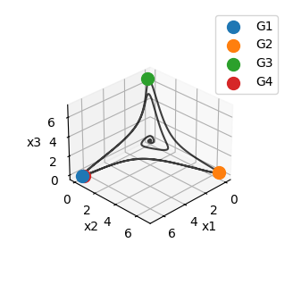

As we can see, ghostID did not recognize the first ghost (G1) when the trajectory revisited it at a later stage and thus considered it to be different ghost,assigning a new identifier (G4) to it. Of, course choosing `delta_gid` too large will do the opposite and assign the same identifier to different ghosts:

```python
ghostSeq = gid.ghostID(farjami_etal,g_Farjami,dt,Trj_farjami,eigval_NN_sorting=True,epsilon_gid=0.15,delta_gid=10,peak_kwargs={"distance":10,"prominence":4,"width":200})

# plot identified ghosts in 3D
import matplotlib.pyplot as plt
fig = plt.figure(figsize=(4,4))
ax = fig.add_subplot(projection='3d')
ax.plot(Trj_farjami[:,0],Trj_farjami[:,1],Trj_farjami[:,2],color='k',alpha=0.75)
for g in ghostSeq:
    ax.scatter(g["position"][0],g["position"][1],g["position"][2],s=100,marker="o",label=g["id"])
ax.set_xlabel("x1")
ax.set_ylabel("x2")
ax.set_zlabel("x3")
ax.set_box_aspect(None, zoom=0.65)
ax.view_init(elev=30, azim=45)
plt.legend()
```


Choosing the right distance threshold is thus essential for identifying the correct number of ghosts and, as of now, requires the user's judgement.

The same issue can arise if we try to identify ghosts in a system using multiple trajectories. Suppose trajectory A first visits ghost x then ghost y, then ghostID assings identifiers G1 and G2 to x and y, respectively. Now suppose trajectory B only visits ghost y, then ghostID assigns identifier G1 to y. In such situations, PyGhostID'S `unify_IDs` can be used to unify identifiers across based on the same distance thresholding idea, i.e., using the analogous threshold `delta_unify`.

To illustrate this, we will use a simple model for cascading climate tipping points by [Wunderling et al](https://esd.copernicus.org/articles/12/601/2021/).

```python
def wunderling_model(t, Z, para):
    Z = jnp.asarray(Z, dtype=jnp.float32)

    d,GMT,Tcrits,Taus,mat_inter=para

    intrinsic = -Z**3 + Z + np.sqrt(4/27)*GMT/Tcrits
    coupling = d/10* mat_inter @ (Z + 1) # Coupling effects: sum over j of C_ij * x_j

    # Total derivative
    dZdt = (intrinsic+coupling)/Taus

    return jnp.array(dZdt) 

# Set parameters and run test simulation
d = 0.15
GMT = 1.61
Tcrits = np.array([1.5,1.6]) 
Taus = np.array([100,1000])
interactions=np.array([[0,1],
                    [1,0]])

parameters_Wunderling = [d,GMT,Tcrits,Taus,interactions]

# simulate trajectory 
dt = 5
timesteps = np.linspace(0,1e5,int(1e5/dt))

sol1 = solve_ivp(wunderling_model, (0, 1e5), [-1.5,-1.2], t_eval=timesteps, args=(parameters_Wunderling,),method='RK45',rtol=1e-4,atol=1e-6)
sol2 = solve_ivp(wunderling_model, (0, 1e5), [1,-1], t_eval=timesteps, args=(parameters_Wunderling,),method='RK45',rtol=1e-4,atol=1e-6)

Trj1=sol1.y.T
ghostSeq1 = gid.ghostID(wunderling_model,parameters_Wunderling,dt,Trj1,0.03,peak_kwargs={"prominence":2,"width":20*dt}) #
Trj2=sol2.y.T
ghostSeq2 = gid.ghostID(wunderling_model,parameters_Wunderling,dt,Trj2,0.03,peak_kwargs={"prominence":2,"width":20*dt})

# plotting
import matplotlib.pyplot as plt
plt.figure(figsize=(8,4))
plt.subplot(1,2,1)
plt.title("Before unifying IDs")
plt.plot(sol1.y[0],sol1.y[1],'-k',label="Trajectory 1")
plt.plot(sol2.y[0],sol2.y[1],'-r',label="Trajectory 2")

for g in ghostSeq1:
    plt.scatter(g["position"][0],g["position"][1],s=100,marker="o",label=g["id"])
    
for g in ghostSeq2:
    plt.scatter(g["position"][0],g["position"][1],s=100,marker="x",label=g["id"])
plt.legend()
plt.xlabel("x1"); plt.ylabel("x2")


plt.subplot(1,2,2)
plt.title("After unifying IDs")
ghostSeq1_uni, ghostSeq2_uni = gid.unify_IDs([ghostSeq1,ghostSeq2],delta_unify=0.1)
plt.plot(sol1.y[0],sol1.y[1],'-k',label="Trajectory 1")
plt.plot(sol2.y[0],sol2.y[1],'-r',label="Trajectory 2")

for g in ghostSeq1_uni:
    plt.scatter(g["position"][0],g["position"][1],s=100,marker="o",label=g["id"])
    
for g in ghostSeq2_uni:
    plt.scatter(g["position"][0],g["position"][1],s=100,marker="x",label=g["id"])
plt.legend()
plt.xlabel("x1"); plt.ylabel("x2")
plt.tight_layout()
```

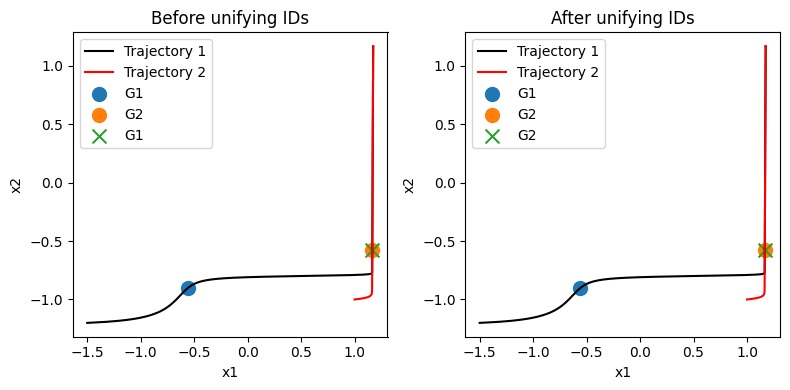

Like in the single-trajectory case you might have to tune `delta_unify`. Choosing an appropriate value of `delta_unify` becomes particularly important when using PyGhostID's `ghostID_phaseSpaceSample` function which samples many trajectories to identify ghosts and internally calls `unify_IDs`.

### Identifying the correct ghost-dimension and finding non-attracting ghosts

In higher dimensional systems with multiple elements close to saddle-node bifurcations the dimension identified by `ghostID` is often underestimated. This is because trajectories may not pass directly through the locally slowest point but only close by. As a consequence, the algorithm can miss one or more of the eigenvalues crossing from negative to positive.

Similarly, finding non-attracting ghosts is by their very nature difficult with a trajectory based algorithm. 

While we're thinking about a complementary mode to identify ghosts without trajectories, currently the only solution to both problems is to sample many trajectories with suitable initial conditions. To restrict the area from which to sample initial conditions, you can use PyGhostID's `qOnGrid` function to identify slow points in phase space and restrict your search to the neighborhood of these slow points.

## Tutorial 2 - Identifying ghost structures: channels, cycles, networks

In [Koch et al. 2024](https://doi.org/10.1103/PhysRevLett.133.047202) we discovered that multiple ghosts can be connected in phase space to form what we termed *ghost channels* and *ghost cycles* akin to heteroclinic connections between saddles forming channels and cycles. More recently, in Koch & Nandan 2026 we found this can be taken even further to complex *ghost networks* in phase space.

PyGhostID features a simple function to reconstruct these ghost structures from trajectories: `ghost_connections`. All you need is a list of one or more `ghostSeq`s and the function will return an adjacency matrix that represents how the ghosts identified in the system are connected to each other. In addition, you can use the `draw_network` function (which makes use of [NetworkX](https://networkx.org/)) to conveniently visualize the identified structures.

A good way to identify ghost structures is to use PyGhostIDs `ghostID_phaseSpaceSample` function, which automatically samples many trajectories within a selected area of phase space, searches for ghosts and unifies their IDs accross samples.

Below you will find three simple examples which illustrate these functionalities.

### Example 1 - ghost channel

In our first example, we will identify and visualize a ghost channel between two ghosts in the model by [Wunderling et al](https://esd.copernicus.org/articles/12/601/2021/) for two mutually coupled climate tipping elements. As in previous tutorials, we run a simulation and identify ghosts from the trajectory:

```python
# imports
import numpy as np
import jax.numpy as jnp
from scipy.integrate import solve_ivp
import PyGhostID as gid
import matplotlib.pyplot as plt

#define the model
def wunderling_model(t, Z, para):
    Z = jnp.asarray(Z, dtype=jnp.float32)

    d,GMT,Tcrits,Taus,mat_inter=para

    intrinsic = -Z**3 + Z + np.sqrt(4/27)*GMT/Tcrits
    coupling = d/10* mat_inter @ (Z + 1)

    # Total derivative
    dZdt = (intrinsic+coupling)/Taus

    return jnp.array(dZdt) 

# Set parameters
d = 0.15
GMT = 1.61
Tcrits = np.array([1.5,1.6]) 
Taus = np.array([100,1000])
interactions=np.array([[0,1],
                    [1,0]])

parameters_Wunderling = [d,GMT,Tcrits,Taus,interactions]

dt = 5
timesteps = np.linspace(0,1e5,int(1e5/dt))

# simulate trajectory 
sol = solve_ivp(wunderling_model, (0, 1e5), [-1.5,-1.2], t_eval=timesteps, args=(parameters_Wunderling,),method='RK45',rtol=1e-4,atol=1e-6)

# identify ghosts
Trj=sol.y.T
ghostSeq = gid.ghostID(wunderling_model,parameters_Wunderling,dt,Trj,0.03,peak_kwargs={"prominence":2,"width":20*dt})
```

Next, we determine the ghost connections and visualize them:

```python
# identify ghost connections
ghostConnections, labels = gid.ghost_connections([ghostSeq])

# plot ghost connections
plt.figure(figsize=(1,4))
node_colors = ["C0"]*len(ghostConnections)
gid.draw_network(ghostConnections, node_colors, labels, layout="hierarchical",rankdir="TB",node_size=550,label_font_size=12)
plt.gca().margins(1.25)
plt.axis("off")
```


### Example 2 - ghost cycle

In the following example we're gonna identify a 3-ghost cycle in a simple GRN model from [Farjami et al.](https://doi.org/10.1098/rsif.2021.0442) which is organized close to three co-occuring SNIC bifurcations that give rise to three ghosts on the limit cycle.  We run a simulation and identify ghosts from the trajectory:

```python
def farjami_etal(t,x,p):
  
    g = p
    
    g1 = g; g2 = g; g3 = g
    
    b1 = 1e-5; b2 = 1e-5; b3 = 1e-5
    alpha1 = 9; alpha2 = 9; alpha3 = 9
    beta1 = 0.1; beta2 = 0.1; beta3 = 0.1
    h = 3
    d1 = 0.2; d2 = 0.2; d3 = 0.2
    
    dx1 = b1 + g1 / ((1+alpha1*(x[1]**h))*(1+beta1*(x[2]**h))) - d1*x[0]
    dx2 = b2 + g2 / ((1+alpha2*(x[2]**h))*(1+beta2*(x[0]**h))) - d2*x[1]
    dx3 = b3 + g3 / ((1+alpha3*(x[0]**h))*(1+beta3*(x[1]**h))) - d3*x[2]
    
    return jnp.array([dx1, dx2, dx3])

# set parameters
g_Farjami=1.5

# set time parameters
t_end = 800
dt = 0.1
timesteps = np.linspace(0,t_end,int(t_end/dt))

# simulate trajectory 
ICs = [0.6,0.8,0.8]
sol = solve_ivp(farjami_etal, (0, t_end), ICs, t_eval=timesteps, args=(g_Farjami,),method='RK45',rtol=1e-6,atol=1e-6)

# run ghostID
Trj_farjami=sol.y.T
ghostSeq_farjami = gid.ghostID(farjami_etal,g_Farjami,dt,Trj_farjami,eigval_NN_sorting=True,peak_kwargs={"prominence":5,"width":200,"distance":20})
```

Identifying and visualizing the ghost connections, we can see that ghostID found three ghosts that are connected to each other to form a cycle:

```python
# identify ghost connections
ghostConnections, labels = gid.ghost_connections([ghostSeq_farjami])

# plot ghost connections
plt.figure(figsize=(2,2.5))
node_colors = ["C0"]*len(ghostConnections)
gid.draw_network(ghostConnections, node_colors, labels, layout="hierarchical",rankdir="TB",node_size=550,label_font_size=12)
plt.gca().margins(.2)
plt.axis("off")
```

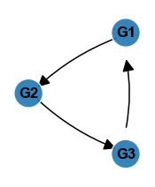

### Example 3 - ghost network

In our last example, we're gonna look at a ghost network emerging from a generic GRN with random topology as in Figure 6 from [Koch & Nandan 2026](https://arxiv.org/abs/2604.05194).

First, we need to define the topology of the GRN, i.e., we need an adjacency matrix that we will generate using the NetworkX package. Let's generate a small random network with eight nodes:

```python
import networkx as nx

n = 10

# for seed in range(1,30):

seed = 21 #14, 21, 23
rng = np.random.default_rng(seed)
np.random.seed(seed)

G = nx.erdos_renyi_graph(n,0.15,directed=True,seed=seed)
A = nx.to_numpy_array(G)

p_inhibitory = 0.5
# introduce inhibitory links
for i in range(A.shape[0]):
    for j in range(A.shape[1]):
        if A[i, j] == 1:
            if rng.random() < p_inhibitory:
                A[i, j] = -1


node_colors = [(0.75, 0.75, 0.5, 0.8)] * n
node_labels = [f"x$_{{{i}}}$" for i in range(n)]

plt.figure(figsize=(5,4))
gid.draw_network(A, node_colors, node_labels, layout="neato",node_size=300,label_font_size=9,graphviz_args=f"-Gepsilon=.0001 -Goverlap=false -Gstart=5 -splines=true")
plt.axis("off")
```

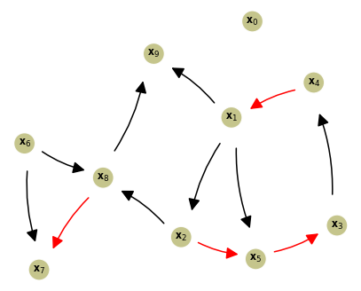

Next, we need to identify the ghosts embedded in the dynamics of this networks. This time, however, we will use PyGhostID's `ghostID_phaseSpaceSample` function, which allows us to identify ghosts from sampling many trajectories simultaneously while also exploiting multithreading to speed up the process:

```python
# define the model
def GRN_net(t, x, para):
    a, b, K, Ka, Ki, A = para
    x = jnp.asarray(x, dtype=jnp.float32)

    # Nonlinear transforms
    x2 = x**2
    f_self = a * x2 / (x2 + K**2)                 # shape (N,)
    f_exc  = x2 / (x2 + Ka**2)                    # shape (N,)
    f_inh  = Ki**2 / (x2 + Ki**2)                 # shape (N,)

    # Masks
    exc_mask = (A == 1).astype(float)             # shape (N,N)
    inh_mask = (A == -1).astype(float)            # shape (N,N)

    # Excitatory sum
    exc = b * (exc_mask @ f_exc)                  # shape (N,)

    # Inhibitory product
    inh = jnp.exp(inh_mask @ jnp.log(f_inh))        # shape (N,)

    # Final ODE
    xdot = (f_self + exc) * inh - x

    return jnp.asarray(xdot)

# Run ghostID on phase space samples
parameters_GRN_net = [0.998,0.25,0.5,0.5,0.5,A]
dt = 0.1
t_end = 800
timesteps = np.linspace(0,t_end,int(t_end/dt))

result_pss = gid.ghostID_phaseSpaceSample(GRN_net,parameters_GRN_net,0,t_end,dt,
                                        [np.linspace(0,1,10) for i in range(n)],n_samples=100,seed=1,
                                        peak_kwargs={"prominence":2,"width":50*dt},display_warnings=False,epsilon_gid=0.015,eigval_NN_sorting=True,epsilon_SN_ghosts=0.5,epsilon_unify=0.75)
```
```
[ghostID_phaseSpaceSample] Running with threads (11 workers)
Processing ICs: 100%|██████████| 100/100 [04:08<00:00,  2.49s/IC]
```
Identifying and visualizing the ghost connections, we can see that ghostID found a network of ghosts. Additionally, we colored the nodes according dimension of the identified ghosts.

```python
import matplotlib.colors as mcolors
M, M_labels = gid.ghost_connections(result_pss)
unique_ghosts = gid.unique_ghosts(result_pss)

dimensions = [g["dimension"] for g in unique_ghosts]
maxDim = max(dimensions)
cmap = plt.cm.get_cmap('spring_r', maxDim+1)
nodeColors = [cmap(dim-1) for dim in dimensions]
plt.figure(figsize=(9,9))
gid.draw_network(M, nodeColors, M_labels, layout="neato",node_size=300,label_font_size=8,graphviz_args=f"-Gepsilon=.000001 -Goverlap=true -Gstart=9 -splines=true") #Gstart 2
boundaries = np.arange(maxDim + 1) - 0.5
norm = mcolors.BoundaryNorm(boundaries, ncolors=maxDim)
sm = plt.cm.ScalarMappable(cmap=cmap, norm=norm)
sm.set_array([])
cbar = plt.colorbar(sm, ax=plt.gca(), orientation='vertical', shrink=0.4)
cbar.set_ticks(np.arange(maxDim))
cbar.set_ticklabels([f'{i+1}' for i in range(maxDim)])
cbar.set_label('Ghost dimension')
plt.axis("off")
plt.gca().margins(0.1)
```

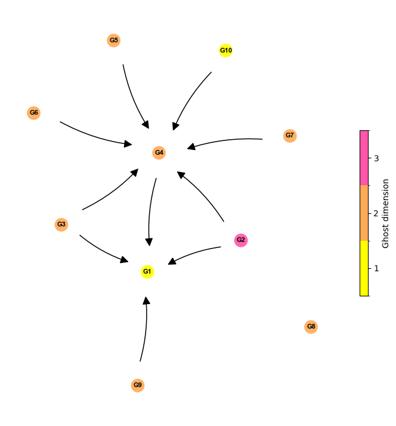

## Tutorial 3 - Tracking ghosts across parameter changes

Another useful feature of PyGhostID is the ability to follow identified ghosts in parameter space as one of the system parameters is changed using the function  `track_ghost_branch`. The basic principle is simple: starting with an identified ghost $G_0$ at parameter $p_0$, the function changes the parameter value by small step to $p_0 + \Delta p$, searches the for the slowest point in phase space within distance $\delta$ of $G_0$'s position in phase space as a candidate ghost, simulates a trajectory within the attracting sector of the candidate ghost and runs `ghostID` on the trajectory. If a ghost is found at parameter $p_0 + \Delta p$, the process is repeated until no more ghost is found or the maximum number of repeats is reached.

To illustrate the use of `track_ghost_branch`, we will reproduce Figure 4b from [Koch & Nandan 2026](https://arxiv.org/abs/2604.05194). The system we're analyzing are two identical and coupled theta-neurons as described in [Augustsson & Martens 2024](https://doi.org/10.1063/5.0226338). From the paper, we know the system has a saddle-node bifurcation at $\eta=0$ in which two saddles, a sink and a repeller coalesce. To begin with we thus launch a trajectory at the parameter value $\eta=0.01$ for which we expect to find a ghost:

```python
# imports
import numpy as np
import jax.numpy as jnp
from scipy.integrate import solve_ivp
import PyGhostID as gid
import matplotlib.pyplot as plt

def coupledThetaNeurons(t, z, para): # from Augustsson & Martens 2024, doi: 10.1063/5.0226338
    n,K,pS = para
    theta1_dot = 1-jnp.cos(z[0]+pS)+(1+jnp.cos(z[0]+pS))*(n+K*(1-jnp.cos(z[1]+pS))) 
    theta2_dot = 1-jnp.cos(z[1]+pS)+(1+jnp.cos(z[1]+pS))*(n+K*(1-jnp.cos(z[0]+pS))) 
    return jnp.array([theta1_dot,theta2_dot])

# set parameters
n = 0.01; K = 0.1; pS = np.pi
parameters_theta =  [n,K,pS]

# simulate trajectory 
dt = 0.005
timesteps = np.linspace(0,30,int(30/dt))
sol = solve_ivp(coupledThetaNeurons, (0, 30), [0.25,0.25],
                    t_eval=timesteps, args=(parameters_theta,),method='RK45',rtol=1e-4,atol=1e-6)

# run ghostID
Trj=sol.y.T
ghostSeq, ctrlPlots = gid.ghostID(coupledThetaNeurons,parameters_theta,dt,Trj,peak_kwargs={"prominence":0,"width":50},eigval_NN_sorting=True,ctrlOutputs={"ctrl_qplot":True,"qplot_xscale":"linear","ctrl_evplot":True,"return_ctrl_figs":True}) #

#  plot phase space
xmin=0;xmax=2*np.pi
ymin=0;ymax=2*np.pi

Ng=200
x_range=np.linspace(xmin,xmax,Ng)
y_range=np.linspace(ymin,ymax,Ng)
grid_ss = np.meshgrid(x_range, y_range)
Xg,Yg=grid_ss

plt.figure(figsize=(3,3))
ax = plt.gca()

# plot trajectory
ax.plot(sol.y[0],sol.y[1],'-',lw=2)

# nullclines
f1,f2 = coupledThetaNeurons(0,jnp.array([Xg,Yg]),parameters_theta)
ax.contour(Xg, Yg, f1, levels=[0], colors='blue', linewidths=1.5, linestyles='-')
ax.contour(Xg, Yg, f2, levels=[0], colors='deepskyblue', linewidths=1.5, linestyles='--')
ax.plot([], [], color='blue', lw=1.5, linestyle='-', label=r'$\dot\theta_1 = 0$')
ax.plot([], [], color='deepskyblue', lw=1.5, linestyle='--', label=r'$\dot\theta_2 = 0$')

# plot ghost
gx,gy = ghostSeq[0]["position"]
ax.plot(gx,gy,'ow',mec='m',markersize=8,alpha=0.75,label=f'ghost (dimension={ghostSeq[0]["dimension"]})')


#labels, limits, legend
ax.set_xlabel(r"$\theta_1$")
ax.set_ylabel(r"$\theta_2$")
ax.set_xlim(xmin,xmax); ax.set_xticks([0,np.pi,2*np.pi]); ax.set_xticklabels(['0',r'$\pi$',r'$2\pi$'])
ax.set_ylim(ymin,ymax); ax.set_yticks([0,np.pi,2*np.pi]); ax.set_yticklabels(['0',r'$\pi$',r'$2\pi$'])
ax.legend(fontsize=7)

plt.show()
```
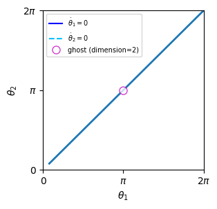

Next, we will use this ghost as a starting point and track it as we increase $\eta$. We start only with the mandatory arguments: the ghost to start with, the model function, the model parameters, the index of the parameter to be changes (in our case 0), the number of steps (i.e. how often the parameter should be increased or decreased), the stepsize of the parameter change ($\Delta p$), the duration of the trajectory and the temporal stepsize.

```python
ghost_start = ghostSeq[0]
positions_ghosts, paramVals, ghostSeqs =  gid.track_ghost_branch(ghost_start, coupledThetaNeurons, parameters_theta, 0, 20, 0.05, 25, dt)
```

```plaintext
Progress:  10.00% | param value=0.11000:  10%|▉         | 2/21 [00:03<00:32,  1.71s/it]
GhostID: Trajectory does not leave U_eps - stopping ghostID.
Progress:  60.00% | param value=0.61000:  57%|█████▋    | 12/21 [00:21<00:15,  1.76s/it]
Terminating track_ghost_branch: Error in chosing initial conditions around qmin (both trajectories are diverging). Try different global/local method/options for finding qmin or different icStep size.
```

From the progress bar we can see that function sucessfully finished the first couple of iterations before an error occurs. The error message indicates that the algorithm failed to initialize a trajectory within the ghost's attracting sector which could be because it didn't find the right slow point in phase space to start from or because the trajectory started to close or too far from the identified slow point. It thus suggests to either change the methods for finding the slow point (qmin) or the distance from the slow point from which the trajectory is started (`icStep`). We will begin with the first of the two suggestions. We increase the search radius for slow points to `delta=0.35` and while we keep the default global method of searching for a slow point (latin hypercube sampling: `global_method ="lhs"`), we will increase the number of random samples to 150 while disabling local optimization. We also added a seed to the global search options for exact reproducibility.

```python
positions_ghosts, paramVals, ghostSeqs =  gid.track_ghost_branch(ghost_start, coupledThetaNeurons, parameters_theta, 0, 20, 0.05, 25, dt, 
                                                                 delta=0.35, qmin_glob_options={"seed":9,"n_samples":150},qmin_loc_method=None)
```

```plaintext
Progress: 100.00% | param value=1.01000: 100%|██████████| 21/21 [00:17<00:00,  1.17it/s]
```

This time the function runs until all iterations are completed, suggesting it successfully tracked the ghost we started from. Plotting the positions of the ghost versus parameter values along with the bifurcation diagram (data generated via XPPAUT and available in PyGhostID's github repository), however, suggests that the last ghost identified is out of place:

```python
# load bifurcation data from XPPAUT for plotting
with open("Fig4_thetaIdent_bifurcation.dat") as f:
    lines = f.readlines()
    text = "".join(lines)

data = []

for l in lines:
    row = []
    for n in l.split(' ')[:len(l.split(' '))-1]: 
        row.append(float(n))
    data.append(np.asarray(row))

dat_theta_cpld = np.asarray(data)

fig = plt.figure(figsize=(4,3))
ax1 = fig.add_subplot()

#plot data from XPPAUT
id_SN = 0
id_SN_end = 61
ax1.plot(dat_theta_cpld[id_SN:id_SN_end,3],dat_theta_cpld[id_SN:id_SN_end,6],'-r')
id_us_end = 117
ax1.plot(dat_theta_cpld[id_SN_end:id_us_end,3],dat_theta_cpld[id_SN_end:id_us_end,6],':k')

# plot ghost branch
ax1.plot(paramVals, positions_ghosts[:,0],'-o',color='grey', lw=0.5, zorder=1)

ax1.set_ylabel(r"$\theta_1$")
ax1.set_xlabel(r"$\eta$")
ax1.set_xlim(-1,1.1)
ax1.set_yticks([0,np.pi,2*np.pi])
ax1.set_yticklabels(['0',r'$\pi$',r'$2\pi$']);
```

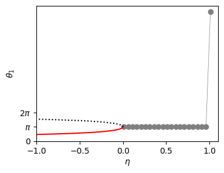

 For some reason `track_ghost_branch` identified a ghost elsewhere in phase space. To avoid this, we will additionally set `distQminThr=0.2`, which represents the maximum allowable distance between the last identified ghost and any slow points that are candidate ghosts. Any ghost candidate which exceeds this distance threshold is rejected, ensuring only candidate ghosts nearby in phase space are considered.

```python
 positions_ghosts, paramVals, ghostSeqs =  gid.track_ghost_branch(ghost_start, coupledThetaNeurons, parameters_theta, 0, 20, 0.05, 25, dt, 
                                                                 delta=0.35, qmin_glob_options={"seed":9,"n_samples":150},qmin_loc_method=None, 
                                                                 distQminThr=0.2)
```

This time we find all ghosts are at the correct positions. Additionally we've colorcoded the ghost branch according to the trapping time that we extracted from the ghosts identified via `track_ghost_branch`:

```python
# load bifurcation data from XPPAUT for plotting
with open("Fig4_thetaIdent_bifurcation.dat") as f:
    lines = f.readlines()
    text = "".join(lines)

data = []

for l in lines:
    row = []
    for n in l.split(' ')[:len(l.split(' '))-1]: 
        row.append(float(n))
    data.append(np.asarray(row))

dat_theta_cpld = np.asarray(data)

fig = plt.figure(figsize=(4,3))
ax1 = fig.add_subplot()

# plot data from XPPAUT
id_SN = 0
id_SN_end = 61
ax1.plot(dat_theta_cpld[id_SN:id_SN_end,3],dat_theta_cpld[id_SN:id_SN_end,6],'-r')
id_us_end = 117
ax1.plot(dat_theta_cpld[id_SN_end:id_us_end,3],dat_theta_cpld[id_SN_end:id_us_end,6],':k')
print(max(dat_theta_cpld[id_SN:id_SN_end,3]))

# extract trapping durations for color coding
trapping_durations = [ghostSeqs[i]["duration"] for i in range(len(ghostSeqs))]

# plot ghost branch
from matplotlib.colors import LogNorm
sc = ax1.scatter(paramVals, positions_ghosts[:,0], c=trapping_durations, marker='o', s=5, norm=LogNorm(), cmap='cool_r', zorder=2)

ax1.set_ylabel(r"$\theta_1$")
ax1.set_xlabel(r"$\eta$")
ax1.set_xlim(-1,1)
ax1.set_yticks([0,np.pi,2*np.pi])
ax1.set_yticklabels(['0',r'$\pi$',r'$2\pi$']);

# Add colorbar
from mpl_toolkits.axes_grid1 import make_axes_locatable
divider = make_axes_locatable(ax1)
cax = divider.append_axes("right", size="5%", pad=0.05)
cb = plt.colorbar(sc, cax=cax, label='Trapping duration')
cb.set_ticks([1, 0.1, 0.5, 5])
cb.set_ticklabels(['1', '0.1', '0.5', '5'])
```

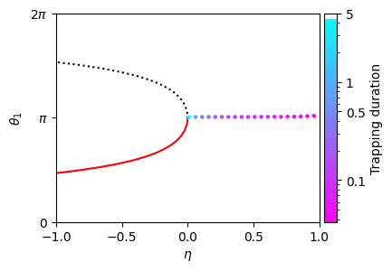

### Troubleshooting, non-attracting ghosts and tracking ghosts versus two parameters

Depending on the model and on which parameter is changed, tracking a ghost versus changing parameters can be difficult. We recommend to also check out the code from [Koch & Nandan 2026](https://arxiv.org/abs/2604.05194) available on the github repository for other examples as well as the API Reference for `track_ghost_branch`.

Currently `track_ghost_branch` does not support tracking of non-attracting ghosts versus parameters or tracking of ghosts while changing two parameters simultaneously. However, in some cases both tasks can be achieved manually using the `ghostID` function. See [Koch & Nandan 2026](https://arxiv.org/abs/2604.05194) for examples.